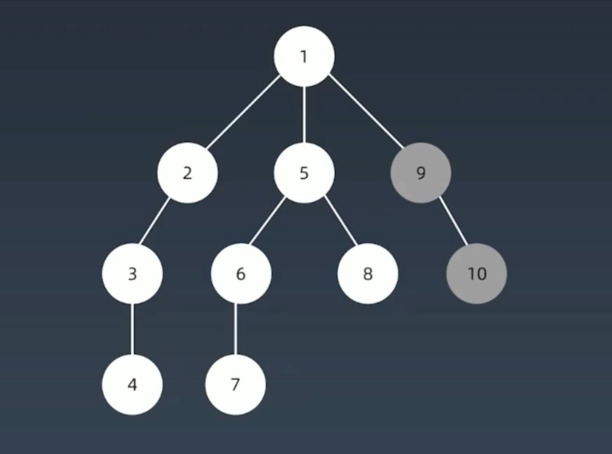
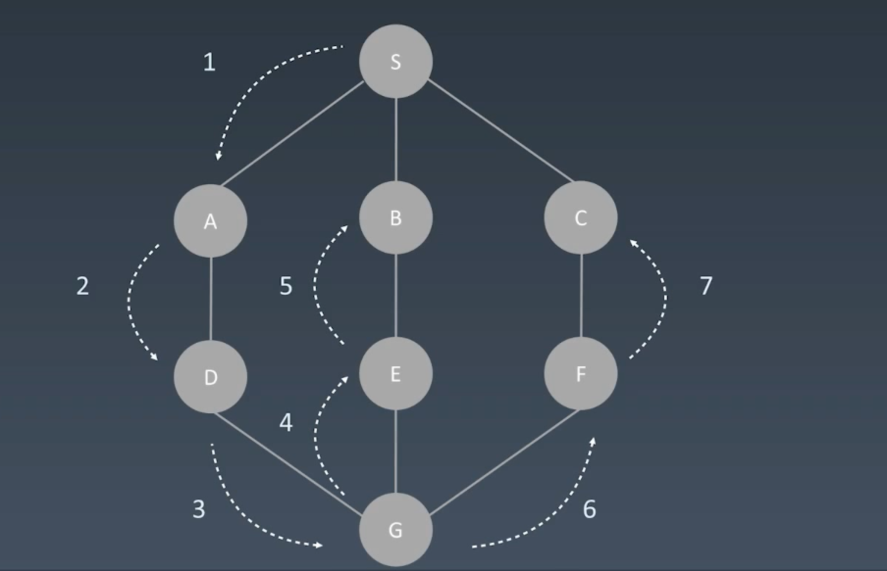
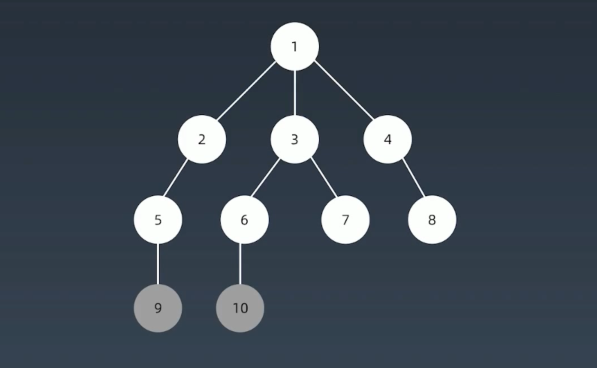
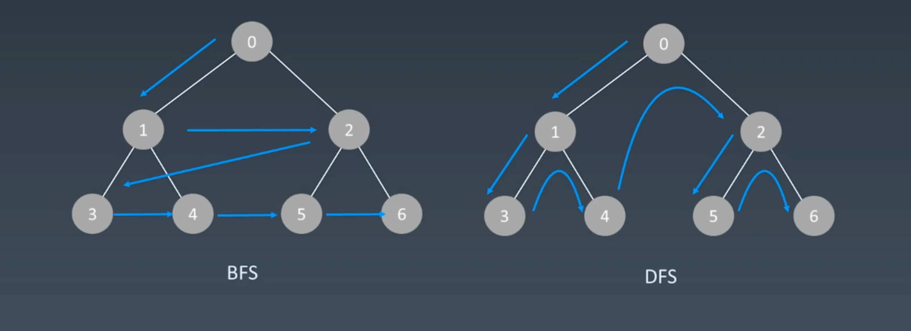

# Deep First Search and Breadth First Search

## Search

- 每个节点都要访问一次

- 每个节点仅仅要访问一次

- 对于节点的访问顺序不限
    - 深度优先
    - 广度优先

- GRAPH TRAVERSAL (DFS/BFS): https://visualgo.net/en/dfsbfs


## Deep First Search 

- 一杆子走到头

- 树的深度优先搜索遍历顺序


- 图的深度优先搜索遍历顺序



- link: https://shimo.im/docs/ddgwCccJQKxkrcTq/read

- python code: recursion
```python
visited = set()

def dfs(node, visited):
    # terminator
    if node in visited:
        # already visited
        return
    
    # add to visited
    visited.add(node)     
    
    # process current node here
    for next_node in node.children():
        if next_node not in visited:
            dfs(next_node, visited)

```


- python code: no recursion
```python
class Is_DFS:

    def DFS(self, root):
        if root is None:
            return []
        
        # init
        visited, stack = [] ,[]
        stack.append(root)
        
        while stack:
            node = stack.pop()
            visited.add(node)
            
            # process node logic
            process(node)

            # 生成相关节点, get children nodes
            nodes = generate_related_nodes(node)
            stack.push(nodes)
    
        # other processing work

```


- java code: recursion

```java
public class someTest {
    public List<List<Integer>> levelOrder(TreeNode root) {
        List<List<Integer>> allResults = new ArrayList<>();

        if (root == null) {
            return allResults;
        }

        travel(root, 0, allResults);
        return allResults;
    }

    private void travel(TreeNode root, int level, List<List<Integer>> results) {
        // terminator
        if (results.size() == level) {
            results.add(new ArrayList<>());
            return;
        }

        results.get(level).add(root.val);

        if (root.left != null) {
            travel(root.left, level + 1, results);
        }
        if (root.right != null) {
            travel(root.right, level + 1, results);
        }

    }
}
```


## Breadth First Search

- 水波纹，地震波的扩散方式

- 树的广度优先搜索遍历顺序


- 树的深度优先和广度优先搜索遍历顺序对比


- link: https://shimo.im/docs/P8TqKHGKt3ytkYYd/read


- python code

```python

def BFS(root):
    visited = []
    queue = []  # use queue
    queue.append([root])

    while queue:
        node = queue.pop()
        visited.add(node)

        process(node)
        nodes = generate_related_nodes(node)  # get children node
        queue.push(nodes)

    # other preprocess work logic
```


- python code
```java
public class someTest {
    public class TreeNode {
        int val;
        TreeNode left;
        TreeNode right;

        TreeNode(int x) {
            val = x;
        }
    }

    public List<List<Integer>> levelOrder(TreeNode root) {
        List<List<Integer>> allResults = new ArrayList<>();

        if (root == null) {
            return allResults;
        }

        Queue<TreeNode> nodes = new LinkedList<>();
        nodes.add(root);

        while (!nodes.isEmpty()) {
            int size = nodes.size();

            List<Integer> results = new ArrayList<>();

            for (int i = 0; i < size; i++) {
                TreeNode node = nodes.poll();
                results.add(node.val);

                if (node.left != null) {
                    nodes.add(node.left);
                }
                if (node.right != null) {
                    nodes.add(node.right);
                }
            }
            allResults.add(results);
        }
        
        return allResults;
    }
    
}
```


