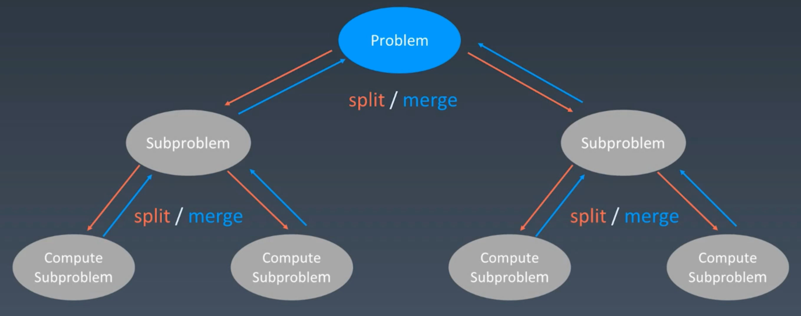
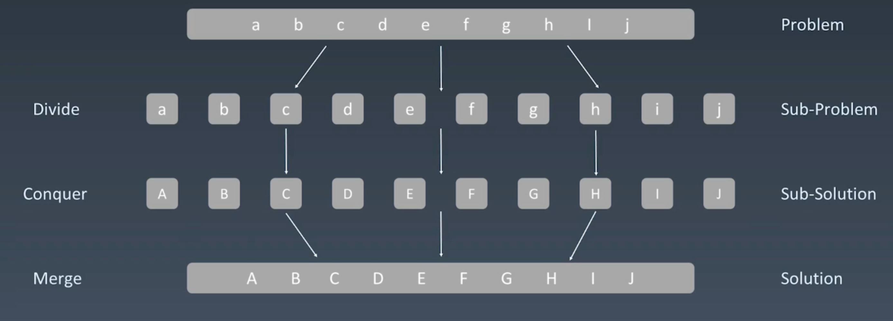

# Divide & Conquer and Backtracking


## Divide & Conquer (分治)

- 递归状态树




- 分治示例




- Code Template:
    - link: [Code Template](https://shimo.im/docs/3xvghYh3JJPKwdvt/read)

- python

```python
def divide_conquer(problem, param1, param2, ...):
    # recursion terminator
    if problem is None:
        # print_result
        return 
    
    # prepare data
    data = prepare_data(problem)
    subproblems = split_problem(problem, data)

    # conquer subproblems
    subresult1 = self.divide_conquer(subproblems[0], p1, p2, ...)
    subresult2 = self.divide_conquer(subproblems[1], p1, p2, ...)
    subresult3 = self.divide_conquer(subproblems[2], p1, p2, ...)
    ...

    # process and generate the final result
    result = process_result(subresult1, subresult2, subresult3, ...)

    # revert the current level states
```


- java

```java

private static int divide_conquer(Problem problem) {
    // recursion terminator
    if (problem == null) {
        int res = process_last_result();
        return res;
    }

    // split problem
    subproblem = split_problem(problem);

    // process current divide problem
    res0 = divide_conquer(subproblem[0]);
    res1 = divide_conquer(subproblem[1]);
    ...

    // generate result
    result = process_result(res0, res1, ...)

    // revert the current level status
}

```


## Backtracking (回溯)


- 回溯是什么？
    - 回溯法采用试错的思想，它尝试分步的去解决一个问题，在分步解决问题的过程中，
    当它通过尝试发现现有的分步答案不能得到有效的正确的解答的时候，他将取消上一步甚至是上几步的计算，
    再通过其他的可能的分步解答在此尝试寻求问题的答案。
    
    - 回溯法通常用最简答的递归方法来实现，在反复重复上述的步骤后，可能出现两种情况：
        - 找到一个可能存在的正确的答案；
        - 在尝试了所有可能的分步方法后，宣告该问题没有答案。
         
    - 在最坏的情况下，回溯法会导致一次复杂度为指数时间的计算。


