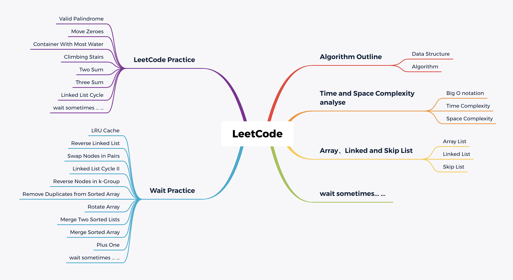

# README

This is my leetcode answer repository.

I hope to help you.

- Outline:

    

- Complexity:

    

## Algorithm Outline

[AlgorithmOutline](./AlgorithmOutline/README.md)

## Time and Space Complexity analyse

[TimeAndSpaceComplexity](./TimeAndSpaceComplexity/README.md)

## Array、Linked and Skip List

[ArrayAndLinkedAndSkipList](./ArrayAndLinkedAndSkipList/README.md)

## Stack、Queue、Deque and Priority Queue 

[StackAndQueueAndDequeaAndPriorityQueue](./StackAndQueueAndDequeaAndPriorityQueue/README.md)

## Some other topic

wait sometimes ......

## LeetCode

PS: Practice make perfect

My LeetCode link: https://leetcode.com/rmliu/

My LeetCode link-cn: https://leetcode-cn.com/u/rmliu/
 

### Practice

- Valid Palindrome (验证回文串)
    - LeetCode: [Valid Palindrome](https://leetcode-cn.com/problems/valid-palindrome/)
    - localAnswer: [Valid Palindrome](./LeetCodePractice/src/ValidPalindrome/[125]验证回文串.java)

- Move Zeroes (移动零)
    - LeetCode: [Move Zeroes](https://leetcode-cn.com/problems/move-zeroes/)
    - localAnswer-java: [Move Zeroes](./LeetCodePractice/src/MoveZeroes/[283]移动零.java)
    - localAnswer-python01: [Move Zeroes](./LeetCodePractice/src/MoveZeroes/[283]移动零01.py)
    - localAnswer-python02: [Move Zeroes](./LeetCodePractice/src/MoveZeroes/[283]移动零02.py)

- Container With Most Water (盛最多水的容器)
    - LeetCode: [Container With Most Water](https://leetcode-cn.com/problems/container-with-most-water/)
    - localAnswer-java01: [Container With Most Water](./LeetCodePractice/src/ContainerWithMostWater/[11]盛最多水的容器01.java)
    - localAnswer-java02: [Container With Most Water](./LeetCodePractice/src/ContainerWithMostWater/[11]盛最多水的容器02.java)

- Climbing Stairs (爬楼梯)
    - LeetCode: [Climbing Stairs](https://leetcode-cn.com/problems/climbing-stairs/)
    - localAnswer-python01: [Climbing Stairs](./LeetCodePractice/src/ClimbingStairs/[70]爬楼梯01.py)
    - localAnswer-python02: [Climbing Stairs](./LeetCodePractice/src/ClimbingStairs/[70]爬楼梯02.py)

- Two Sum (两数之和)
    - LeetCode: [Two Sum](https://leetcode-cn.com/problems/two-sum/)
    - localAnswer-java: [Two Sum](./LeetCodePractice/src/TwoSum/[1]两数之和.java)

- Three Sum (三数之和)
    - LeetCode: [Three Sum](https://leetcode-cn.com/problems/container-with-most-water/)
    - localAnswer-java01: [Three Sum](./LeetCodePractice/src/ThreeSum/[15]三数之和01.java)
    - localAnswer-java02: [Three Sum](./LeetCodePractice/src/ThreeSum/[15]三数之和02.java)
    - localAnswer-python: [Three Sum](./LeetCodePractice/src/ThreeSum/[15]三数之和.py)

- Linked List Cycle (环形链表)
    - LeetCode: [Linked List Cycle](https://leetcode-cn.com/problems/linked-list-cycle/)
    - localAnswer-java: [Linked List Cycle](./LeetCodePractice/src/LinkedListCycle/[141]环形链表.java)

- Permutations (全排列)
    - LeetCode: [Permutations](https://leetcode-cn.com/problems/permutations/)
    - localAnswer-python01: [Permutations](./LeetCodePractice/src/Permutations/[46]全排列01.py)
    - localAnswer-python01: [Permutations](./LeetCodePractice/src/Permutations/[46]全排列02.py)

- Valid Parentheses (有效的括号)
    - LeetCode: [Valid Parentheses](https://leetcode-cn.com/problems/valid-parentheses/)
    - localAnswer-python1: [Valid Parentheses](./LeetCodePractice/src/ValidParentheses/[20]有效的括号1.py)
    - localAnswer-python2: [Valid Parentheses](./LeetCodePractice/src/ValidParentheses/[20]有效的括号2.py)
    - localAnswer-java: [Valid Parentheses](./LeetCodePractice/src/ValidParentheses/[20]有效的括号.java)

-  ()
    - LeetCode: 
    
- wait sometimes ......

### Wait Practice

- LRU Cache (LRU缓存机制)
    - LeetCode: [LRU Cache](https://leetcode-cn.com/problems/lru-cache/)
    - localAnswer: [LRU Cache](./LeetCodePractice/src/LRUCache/[146]LRU缓存机制.java)

- Reverse Linked List (反转链表)
    - LeetCode: [Reverse Linked List](https://leetcode-cn.com/problems/reverse-linked-list/)

- Swap Nodes in Pairs (两两交换链表中的节点)
    - LeetCode: [Swap Nodes in Pairs](https://leetcode.com/problems/swap-nodes-in-pairs/)

- Linked List Cycle II (环形链表 II)
    - LeetCode: [Linked List Cycle II](https://leetcode-cn.com/problems/linked-list-cycle-ii/)

- Reverse Nodes in k-Group (K 个一组翻转链表)
    - LeetCode: [Reverse Nodes in k-Group](https://leetcode-cn.com/problems/reverse-nodes-in-k-group/)

- Remove Duplicates from Sorted Array (删除排序数组中的重复项)
    - LeetCode: [Remove Duplicates from Sorted Array](https://leetcode-cn.com/problems/remove-duplicates-from-sorted-array/)

- Rotate Array (旋转数组)
    - LeetCode: [Rotate Array](https://leetcode-cn.com/problems/rotate-array/)

- Merge Two Sorted Lists (合并两个有序链表)
    - LeetCode: [Merge Two Sorted Lists](https://leetcode-cn.com/problems/merge-two-sorted-lists/)

- Merge Sorted Array (合并两个有序数组)
    - LeetCode: [Merge Sorted Array](https://leetcode-cn.com/problems/merge-sorted-array/)

- Plus One (加一)
    - LeetCode: [Plus One](https://leetcode-cn.com/problems/plus-one/)

-  ()
    - LeetCode: 

-  ()
    - LeetCode: 

- wait sometimes ......

