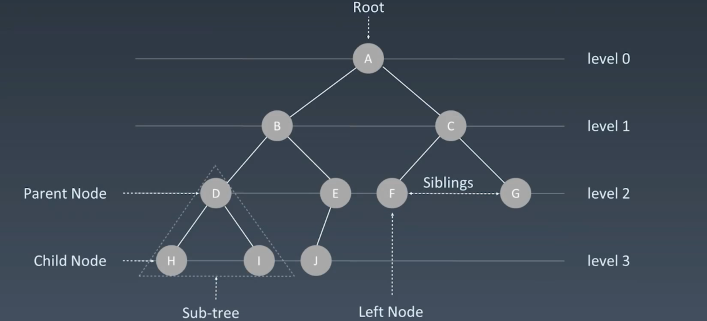

# Tree、Binary Tree and Binary Search Tree

- visualising data structures and algorithms through animation：https://visualgo.net/en


## Tree

- Linked List 是特殊化的Tree

- Tree 是特殊化的Graph (没有环的图就是树)

- Tree Node

```python
class TreeNode:
    def __init__(self, val):
        self.val = val
        self.left, self.right = None, None
```

```java
public class TreeNode{
    public int val;
    public TreeNode left, right;
    
    public TreeNode(int val) {
        this.val = val;
        this.left = null;
        this.right = null;
    }
}
```




## Binary Tree

### Binary Tree (Pre-order、In-order、Post-order)
- Pre-order 
    - 前序遍历（中(根)，左，右）
- In-order
    - 中序遍历（左，中(根)，右）
- Post-order
    - 后序遍历（左，右，中(根)）

- order
```python
class TreeNode:
    def __init__(self, val):
        self.val = val
        self.left, self.right = None, None

    def pre_order(self, root):
        if root:
            self.traverse_path.append(root.val)
            self.pre_order(root.left)
            self.pre_order(root.right)

    def in_order(self, root):
        if root:
            self.in_order(root.left)
            self.traverse_path.append(root.val)
            self.in_order(root.right)

    def post_order(self, root):
        if root:
            self.post_order(root.left)
            self.post_order(root.right)
            self.traverse_path.append(root.val)

```


## Binary Search Tree
- 定义：二叉搜索树，也称二叉查找树，有序二叉树（Orderd Binary Tree），排序二叉树（Sorted Binary Tree），
是指一棵空树或者具有下列性质的二叉树：
    - 左子树上`所有节点`的值均小于它的根节点的值
    - 右子数上`所有节点`的值均大于它的根节点的值
    - 以此类推：左、右子树也分别为二叉查找树
    
    - ps:中序遍历为升序排列

- Search
O(log n)

- Insertion
O(log n)

- Deletion
O(log n)


